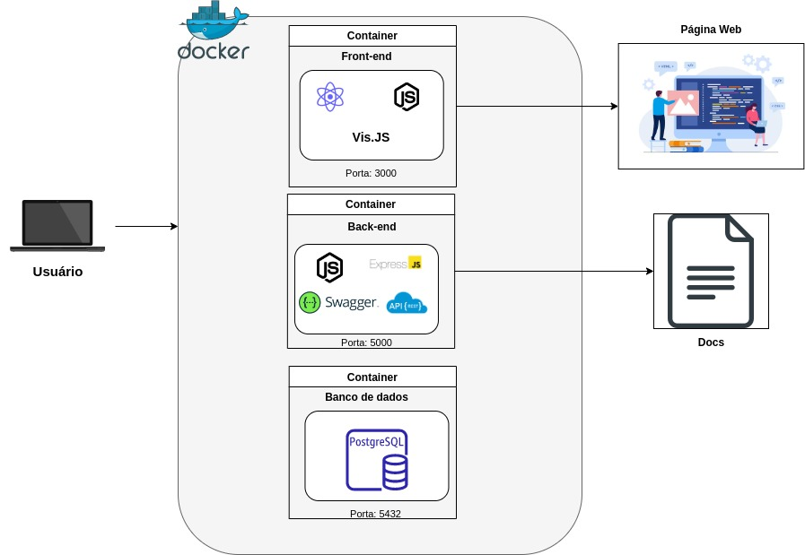

<h1>Sistema de Gerenciamento Empresarial</h1>

Esta é uma aplicação direcionada para o publico alvo de fabricas ou empresas em longa escala que exige uma demanda muito alta de funcionarios, nas quais necessitam de um sistema para gerenciar quem entra nessa empresa e ver suas informações, tais como em qual setor se encontra e em qual posição está atualmente ou como foi contratado.

<h2> Histórias de usuário: </h2>

<ul>
    <li>
        

           Eu, como administrator de sistema, gostaria de acessar um formulário, preencher o nome do empregado, selecionar seu cargo em uma combo e sua área de atuação e salvar.
        

    </li>
    <li>
        

            Eu, como administrador do sistema, gostaria de pesquisar o nome de um empregado e visualizá-lo em destaque na hierarquia da empresa.
        

    </li>
    <li>
        

            Eu, como administrador do sistema, gostaria de visualizar os empregados de uma área.
        

    </li>
</ul>
<h2>Arquitetura do Diagrama</h2>

  

